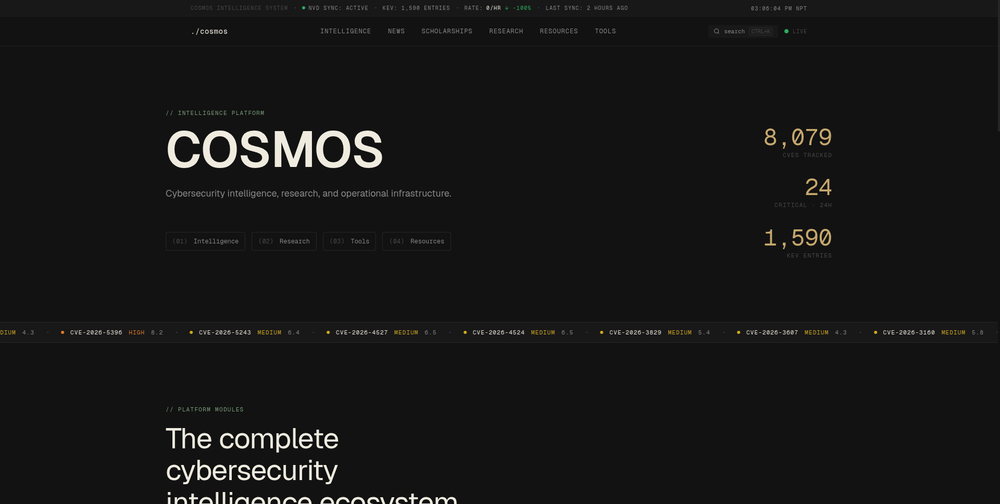

# COSMOS

A cybersecurity intelligence platform  live CVE tracking, KEV monitoring, research, curated resources, and in-browser security tools.

---

## Preview

<!-- Add your homepage screenshot here -->

---

## Stack

| Layer | Technology |
|---|---|
| Framework | Next.js 16 (Turbopack) |
| UI | React 19, Tailwind CSS 3, shadcn/ui, Lucide |
| Backend | Supabase (Postgres + RLS) |
| Auth | Supabase Auth (`signInWithPassword`) |
| Language | TypeScript 5.9 |
| Deployment | Vercel |

---

## Routes

| Path | Description |
|---|---|
| `/` | Homepage  live CVE feed, threat ticker, KEV highlights |
| `/intelligence` | Full CVE table with severity/keyword filters |
| `/research` | Published research posts (Markdown) |
| `/resources` | Curated security resources with trust ratings |
| `/tools` | In-browser security tools (no data leaves the tab) |
| `/news` | Cybersecurity news feed |
| `/scholarships` | Scholarship tracker |
| `/digest` | Daily digest |
| `/feed.xml` | RSS feed |
| `/admin` | Protected admin panel |

---
